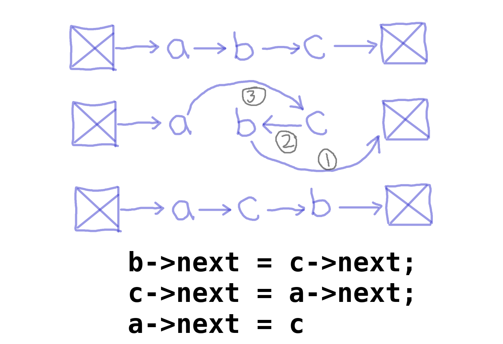

So, after a very good amount of struggle, finally i was able to solve this problem.

The main intuition of the solution is, For each group of k nodes, we need to reverse the links between them, which is exactly (k-1) links.

eg: 1->2->3->4->5->NULL and k = 3

for this example, we've only one group of 3 nodes, so we'll reverse both links in the group and it'll look like

after 1st reversal: 2->1->3->4->5->NULL

after 2nd reversal: 3->2->1->4->5->NULL

So, first of all, i'll be discussing, how we'll be reversing that one link very smartly.

Now, you can have a look at this image below, i tried to sketch the process.



These three magical lines reverses one link, without interfering with other links. Let's understand it line by line.

1. The first thing, before reversing the b->c link, we don't want to lose c's next, so we will hold c's next with b's next.
2. Now, we can reverse b->c link and c's next will point to a's next, which is currently b. (It'll not always be b where we want to point, that's why we'll be doing a's next).
3. The last thing we've left to do is to point a's next to c and now our one link got reversed successfully.

Now let's have a look at the code.

```

class Solution {
public:
    ListNode* reverseKGroup(ListNode* head, int k) {
        ListNode* dummy = new ListNode();
        dummy->next = head;
        ListNode* pre = dummy, *cur, *nex;
        int cnt = length(head);
        // continue till more than k groups left
        while(cnt>=k){
            // maintain the order [ pre->cur->nex ] 
            cur = pre->next;
            nex = cur->next;
            // reverse (k-1) links in the group
            for(int i = 1; i < k; ++i)
                reverseSingleLink(pre, cur, nex);
            cnt -= k;
            // to move to next group, pre will now be cur
            pre = cur;
        }
        return dummy->next;
    }
private:
    void reverseSingleLink(ListNode* &pre, ListNode* &cur, ListNode* &nex){
        // to move forward in the group
        nex = cur->next;
        // those three magical lines
        cur->next = nex->next;
        nex->next = pre->next;
        pre->next = nex;
    }
    // to find the length of the list
    int length(ListNode* head){
        int cnt = 0;
        while(head){
            ++cnt;
            head = head->next;
        }
        return cnt;
    }
};

```